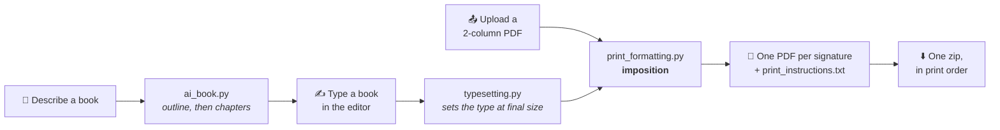
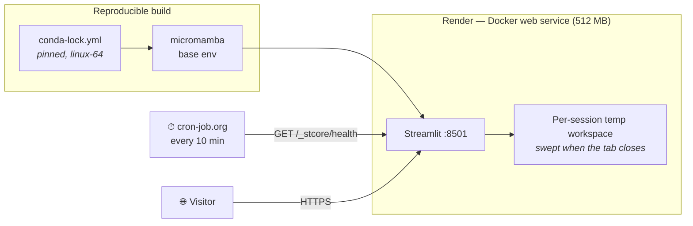
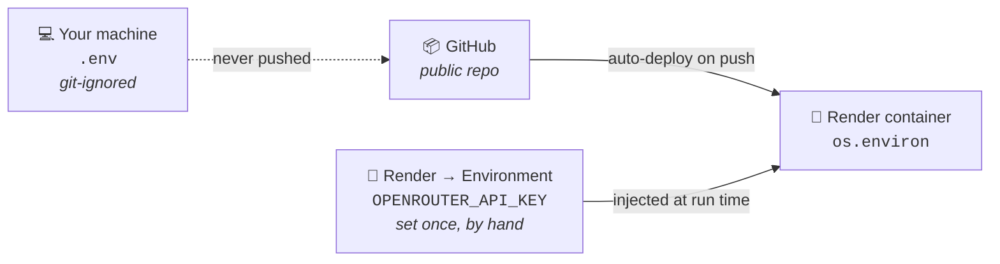

<div align="center">

# 📖 Bookbinding Signature Creator

**Turn any 2-column PDF — or a book you type in the browser — into ready-to-print, foldable signatures.**

[](https://bookbinding-signature-creator.onrender.com)
&nbsp;
[](#-deployment--architecture)

[](https://www.python.org/)
[](https://streamlit.io/)
[](./Dockerfile)
[](https://render.com/)
[](#-testing)
[](./LICENSE)

**[▶ Open the live app](https://bookbinding-signature-creator.onrender.com)** · [What it does](#-what-it-does) · [Architecture](#-deployment--architecture) · [Engineering notes](#-engineering-highlights) · [Run it locally](#-run-it-yourself)

</div>

---

> **The short version.** Hand-binding a book means printing it as *signatures* — small stacks of sheets, each printed double-sided, folded once and nested inside one another. Getting the page order right by hand is tedious and easy to ruin. This app does the imposition for you, on any paper a printer will accept, and hands back one zip per book in print order.
>
> **Nothing is stored.** Your books exist on the server only while the tab is open. The one copy that lasts is the zip you download yourself. The single thing that ever leaves the server is the description you type into the AI box, and only when you press that button — [what that involves](#-the-ai-writer-and-where-its-key-lives).

I built it because I wanted to print signatures for a series of nine books for a bookbinding hobby, and writing the tool is more enjoyable than manually setting up the signature format for the mountain of pages which those nine books come to. It was fun and ended up saving me some time too.

---

## ✨ What it does

<table>
<tr>
<td width="50%" valign="top">

### 📚 Convert an existing PDF

Upload a 2-column book PDF. Pick the paper you'll actually load in the printer. Get back one PDF per signature plus a `print_instructions.txt` recording the paper size, scaling and duplex setting used — all as a single zip, in print order.

Books that aren't numbered yet can be **page-numbered first**, as a separate step that leaves the original untouched. 

</td>
<td width="50%" valign="top">

### ✍️ Write the book in the app

Type a book straight into the browser — title, author, dedication, chapters, appendix — and it is typeset into exactly the kind of 2-column PDF the converter reads, then folded into signatures without ever leaving the page.

**Nothing is ever scaled here.** The paper isn't something to fit a finished book onto afterwards; it's the size the book is *set* at.

</td>
</tr>
</table>

### 🤖 Or have one written

A one-line description — *"a warm, plain-English beginner's guide to hand bookbinding"* — fills the editor in with a five-chapter mini-novel, which you then edit like anything else you typed. The words appear on the page **as they are written** rather than after a silent wait, and every book is held to a hard ceiling of 5,000 tokens. Optional, off unless a key is configured, and it writes the **words only**: your page size, type and margins are left exactly as you set them. [How it works, and where its key lives.](#-the-ai-writer-and-where-its-key-lives)



The AI writer joins at the *editor*, not at the pipeline: it produces a `Manuscript`, the same object the editor already holds, so everything downstream of it is code that was already there and already tested.

The bridge between the two halves is deliberately narrow: the editor writes an **ordinary input PDF**, and from that moment a typed book is indistinguishable from one that came from anywhere else. There is no second pipeline to keep in step with the first.

---

## 🚀 Deployment & Architecture

The app is containerized with Docker and runs **24/7 on Render's free tier** — with no cold starts.



### Tech stack & environment

| Layer | Choice | Why |
| --- | --- | --- |
| **Framework** | Streamlit (Python 3.12) | The whole GUI is Python; no separate front end to keep in sync. |
| **Environment** | micromamba | Small, fast, no full conda install inside the image. |
| **Dependency locking** | [`conda-lock.yml`](./conda-lock.yml) | Targeted at **`linux-64`** for exact cross-platform reproducibility — and to pin Streamlit, so an unpinned upgrade cannot break the custom GUI CSS classes the interface relies on. |
| **Container** | [`mambaorg/micromamba:1.5.8`](./Dockerfile) | A specific, locked base image rather than a floating tag. |
| **Host** | Render (free tier, Docker) | 24/7 public URL from a container built straight out of the repo. |
| **AI writing** | LangChain → OpenRouter (`meta-llama/llama-3.1-8b-instruct`) | Optional and off without a key. One small, quick model, streamed to the page as it writes. [Details below.](#-the-ai-writer-and-where-its-key-lives) |
| **Secrets** | Render environment variables | The key is never in the repo and never in the image; `.env` is for local use only. |

### Docker configuration

The container is built **strictly from the unified `conda-lock.yml`**, which sidesteps the OS-specific binary conflicts (Windows C++ runtimes, for one) that surface when a Windows-authored environment is resolved inside a Linux image at deploy time.

```dockerfile
FROM mambaorg/micromamba:1.5.8
COPY --chown=$MAMBA_USER:$MAMBA_USER conda-lock.yml .
RUN micromamba install --name base --yes --file conda-lock.yml && \
    micromamba clean --all --yes
COPY --chown=$MAMBA_USER:$MAMBA_USER . .
EXPOSE 8501
CMD ["micromamba", "run", "-n", "base", "streamlit", "run", "app.py", \
     "--server.port=8501", "--server.address=0.0.0.0"]
```

Streamlit defaults to port **8501**, and the Render environment variable `PORT=8501` is exposed so traffic routes to the containerized app.

### Continuous uptime on a free tier

Render spins free Docker instances down after **15 minutes** of inactivity, which means the next visitor waits through a cold start. To keep the app instantly responsive:

- An automated **cron job (cron-job.org)** sends an HTTP `GET` every **10 minutes**.
- **The optimization:** the ping targets Streamlit's hidden diagnostic endpoint **`/_stcore/health`** rather than the main URL. That registers as active web traffic to Render *without* forcing Streamlit to execute the Python script or render the UI — which conserves the container's **512 MB RAM** limit.
- **Quota management:** the strategy consumes **~744 instance-hours per month**, fitting inside Render's **750 free monthly hours** with deliberate headroom.

> The app behaves identically wherever it runs. There is no "local mode" and no "hosted mode", because a rule that only applies when deployed is a rule nobody has tested — `streamlit run app.py` on your own machine gives you the same ephemeral session folder that the container does.

### 🤖 The AI writer, and where its key lives

**🤖 Generate 5 chapter mini-novel for printing with AI** takes a one-line description and fills the writing view in with a whole book: title, author, dedication and every chapter.

All of it is in [`Script/ai_book.py`](./Script/ai_book.py), which imports LangChain and nothing from Streamlit, and [`Script/ai_config.py`](./Script/ai_config.py).

**Five chapters, three requests, five thousand tokens.** Three budgets rather than three preferences, and each fixes something that went wrong in practice.

*The chapter count* is fixed because a model will not treat it as a number. A description asking for "a short novel" came back with twice the chapters of one that had asked for a full-length novel — length words read as tone, not as instructions. So the count goes into the JSON schema as `minItems` and `maxItems`, is trimmed or padded again after the reply, and is printed on the button. A description that asks for something sprawling gets that story told in five chapters instead of a longer book.

*The request count* is fixed because a request is the unit of everything costly here: of waiting, of tokens paid for, and — on a copy configured with a free model — of a ration of roughly **50 a day** shared by everyone using it. A request per chapter cost six for a five-chapter book. Batching the chapters into the requests left after the outline brings that to three.

```text
request 1   outline      title, author, dedication, 5 headings + summaries
request 2   chapters 1-3
request 3   chapters 4-5
```

Batching is only safe because of `salvage_chapters`. A reply that runs past the model's output limit is truncated JSON — but the chapters that *did* finish are complete objects inside it, so they are mined out and kept. Recovering three good chapters costs nothing; asking again costs a request the book does not have.

#### The 5,000-token ceiling

**A book costs at most 5,000 tokens, input and output, first request to last.** Not on average. Ever. `_Ledger` in [`ai_book.py`](./Script/ai_book.py) is what makes that a fact rather than an intention, and the argument has exactly two halves:

| Half | Bounded by | How |
| --- | --- | --- |
| **Output** | the service | every request carries `max_tokens`, which the provider enforces |
| **Input** | this repo | it is text this repo composed, measured by `estimate_tokens` before it is sent |

So the worst a request can come to is *estimated input + `max_tokens`*, and a request is only sent when that whole worst case still fits in what is left. The ledger charges the worst case up front, sends, then refunds whatever the reply did not use — so between the two the total already covers a reply that has not arrived. Each batch is allotted its share of what remains, and the input of the batches still to come is held back so an early one cannot spend the tokens a later one needs to exist.

**Measuring the input is the hard half, and it is why there are two estimators.** A token is not a fixed number of bytes: against a real tokenizer, English prose runs about 4.5 bytes to the token, a line of pure punctuation runs 1.6, and a string of combining accents runs 1.2. One ratio is therefore either wasteful for the text the app sends or unsafe for text somebody can paste into the box. So prompt text — written in `ai_book.py`, and held to its ratio by a test that checks every prompt against a real tokenizer — is measured at 3 bytes to the token; anything that has been outside, a typed description or a model's reply quoted back to it, is measured at 1.2, which nothing realistic beats.

**Running out is never an error.** This is the part worth stating loudly, because it is what the limit is *for*. When the ledger cannot afford a request, the chapters it would have written are made by `from_plan` from their own outline summaries, which costs nothing. The same happens when the clock runs out, when the request budget runs out, when a reply is unreadable, and when a format probe eats a request. Every budget in the file now says "no" instead of raising, and the reader gets a book with a heading and a line of plan in the thin chapters, sitting in an editor, waiting to be written over. **A shorter book, never a broken one.**

Genuine service failures — a bad key, a rate limit, a network that is not there — still raise, because those are things the reader has to be told about and cannot be papered over with a summary.

Lowering `AI_TOKEN_LIMIT` shortens the book; it cannot break it, and there is a test that walks it down from 5,000 to nothing and checks exactly that. Raising `AI_MAX_CALLS_PER_BOOK` gives more, smaller batches — but not more tokens: the two budgets are separate, and the token one binds.

**The book is streamed.** The reply arrives token by token, and the words go onto the page as they are written — headings, paragraphs, a sentence still half-finished — into a box under the button. It costs nothing and changes no request; the same complete reply is parsed by the same code when the stream ends. It does not make the model faster. It makes the wait readable, and the wait was what "slow" actually meant here.

Reading a book out of a reply that has not arrived yet is the interesting part, because a part-arrived JSON object is not JSON and `json.loads` will never take it. `_json_strings` reads the strings straight out of the fragment instead, telling a key from a value by tracking the containers it is inside, and returning the final unfinished string as well — a half-written sentence is exactly what somebody watching wants to see. `stream_prose` lays those out; `_Live` keeps the chapters that have finished so the next batch appears *under* them rather than over them.

**It is optional.** With no key set, the button is drawn switched off with a line explaining why, and the rest of the app is untouched. The LangChain import happens *inside* the call that needs it, so a machine without `langchain-openai` installed still runs the whole app — the test suite is proof, since it never installs it.

**The model is `meta-llama/llama-3.1-8b-instruct` — Meta: Llama 3.1 8B Instruct.** One model, named, the same one every time. Small is the point: at eight billion parameters it answers in a fraction of the time a large model takes, and the complaint this feature attracted was never about the prose.

*Which provider serves it is OpenRouter's decision.* Five of them offer this model, and the request carries no `provider` block telling OpenRouter which to prefer — its own routing already weighs cost heavily, and that is the wanted behaviour.

*It is not free, and the app no longer pretends otherwise.* $0.02 per million tokens in and $0.04 out, so a whole book costs a small fraction of a penny — but paid is paid, so `OPENROUTER_FREE_ONLY` now defaults to **0**. With it at 1 and a paid model set, every press of the button comes back refused, which is why the two had to move together. **The credit limit on the key is the ceiling**, and it is the only control OpenRouter enforces for you. A copy that must not be able to spend anything sets `OPENROUTER_FREE_ONLY=1` *and* `OPENROUTER_MODEL=openrouter/free`; the guard is untouched and still works exactly as it did.

*The JSON ladder earns its keep here.* An 8B model is less reliable about strict schemas than a large one, and support varies by provider. `RUNGS` starts at `json_schema`, drops to `json_object` and then to asking in the prompt, remembers which rung worked, and `salvage_chapters` mines a truncated reply for the chapters that finished.

The outline and the style note are sent with *every* chapter request. Not because the model changes between them any more, but because there is no conversation to remember them — each request stands alone, and the outline is what holds the voice together. The description itself is not sent again in full: the outline was written from it, and a trimmed line of it goes with each batch for flavour. Repeating it cost more tokens than the chapters those tokens would have bought.

#### The button knows you are typing

Streamlit only tells the server what is in a text box when the box loses focus. The ✍️ button was switched off until the server had a description, so it looked broken: you typed one, nothing happened, and you had to click somewhere else before the button would light up — and then click it.

There is no Python for a keystroke, so `TYPING_SCRIPT` at the foot of [`app.py`](./app.py) asks the browser directly — the same `st.iframe` trick the appearance radio uses to reach Streamlit's own theme menu, finding the widgets through the `st-key-…` classes their keys put on them. On every keystroke it switches the button and takes the bracketed **(Please type a description of the book to generate)** half of the label off or puts it back.

**Which way round it is switched is the whole trick, and the obvious way does not work.** Letting the server draw the button off and having the script switch it on gets you a button that lights up and then eats the press: Streamlit's button ignores a click whenever *React* thinks it is disabled, and React thinks what the server told it. Clearing the attribute in the page changes the colour, lets the browser fire its events, and the component drops them anyway — which looks worse than the bug it was meant to fix.

So it is the other way round. **The server draws the button on**, the script makes it look and behave off while the box is empty — the `disabled` attribute greys it, blocks the pointer and takes it out of the tab order — and the click handler in `app.py` refuses an empty description on the server. React is never told the button is off, so the first press after typing is a real one. Pressing it sends the box's value along with the click, because losing focus to the button is what flushes it.

**The server still decides.** The script only changes what is drawn between reruns, and there is a test that the words it puts on the button are the same string the label is built from, so the two cannot drift. It is also told, in its own text, when the button is off for a reason that has nothing to do with typing — a job running, a full disk, no key — and then it keeps its hands off entirely.

#### Setting the key on Render

**The key is not part of the deploy.** This is the thing worth getting straight: Render pulls the code from GitHub, but it reads the key from its *own* settings, which live in Render and never touch the repository. The two are entirely separate paths into the container. You set the key once, by hand, and every future `git push` picks it up without you doing anything.



**Do this once:**

1. Get a key at **[openrouter.ai/keys](https://openrouter.ai/keys)**. Make it a key used by nothing else, and **set a credit limit on it** while you are there.
2. Open your service in the **[Render dashboard](https://dashboard.render.com)** → **Environment** in the left-hand menu.
3. **Add Environment Variable**:
   - **Key:** `OPENROUTER_API_KEY`
   - **Value:** your key
4. **Save Changes.** Render redeploys on its own — the variable change *is* a deploy trigger, so you do not need to push anything to activate it.

That is the whole setup. `OPENROUTER_MODEL` and the rest have working defaults; add them only to override. Environment variables persist across deploys, so pushing to GitHub afterwards never clears or re-asks for the key.

> **Use "Environment Variables", never "Secret Files" or a Docker build argument.** A build argument is recorded in the image history and can be read straight back out of the image. `.env` is for your own machine only and is both git-ignored and Docker-ignored.

**Nothing about `[skip render]` changes any of this.** That only tells Render not to rebuild for a given commit; it has no bearing on the key, which is already sitting in the environment either way.

#### Checking it worked

Open the app after the deploy finishes. The button under the title tells you which state you are in, without needing the logs:

| What you see | What it means |
| --- | --- |
| **🤖 Generate 5 chapter mini-novel for printing with AI** is clickable once you type a description | The key arrived. Done. |
| Button greyed out, caption reads *"…No `OPENROUTER_API_KEY` is set…"* | The variable is missing or misnamed. Check the spelling in Render — it is case-sensitive. |
| Button greyed out, caption mentions **langchain-openai** | The key is fine but the image is stale. Redeploy with **Clear build cache**, since `conda-lock.yml` changed. |
| *"…is not a free model, and this copy is set to free models only"* | `OPENROUTER_FREE_ONLY` is at 1 while the model is a paid one — the app's own default included. Switch the flag off, or set `OPENROUTER_MODEL` to `openrouter/free`. |

#### Every setting

All optional except the key, all read from the environment, all documented in [`.env.example`](./.env.example). A bad number falls back to its default rather than taking the app down.

| Variable | Default | What it does |
| --- | --- | --- |
| `OPENROUTER_API_KEY` | *(none)* | The key. Empty or unset switches the button off; everything else still works. |
| `OPENROUTER_MODEL` | `meta-llama/llama-3.1-8b-instruct` | The model that writes the book. `openrouter/free` (the free-model router) and any `:free` model work too. |
| `OPENROUTER_FREE_ONLY` | `0` | Refuse anything that could be charged for, before any request is made. Off, because the default model is paid. Set it to 1 *and* pick a free model together. |
| `OPENROUTER_APP_TITLE` | `Bookbinding Signature Creator` | The `X-Title` header — how OpenRouter's dashboard labels this app's traffic. Identifies the app, never the visitor. |
| `AI_STREAM` | `1` | Show the book as it is written instead of all at once at the end. `0` waits for the whole reply. |
| `AI_TOKEN_LIMIT` | `5000` | Every token one book may cost, input and output. A ceiling that is kept, not a target. Lower it for a shorter book. |
| `AI_CALL_TIMEOUT_SECONDS` | `90` | How long one request may take. |
| `AI_TOTAL_BUDGET_SECONDS` | `420` | How long a whole book may take before it stops asking for more. |
| `AI_CHAPTERS` | `5` | How many chapters every book has. Exactly this many — see below. |
| `AI_MAX_CALLS_PER_BOOK` | `3` | The most requests one book may cost, counting retries. Not more tokens — see the ceiling above. |

#### Why it cannot leak

The repository is public and so is the deployed URL, so the key is never in either. `load_dotenv(..., override=False)` means that even if a `.env` somehow reached a server, it could not shadow the key that server was configured with — there is a test for exactly that.

What stops it leaking, in order of how much each one matters:

1. **[`.dockerignore`](./.dockerignore)** — the `Dockerfile` ends in `COPY . .`, so without it a local `.env` would be baked into a layer of a public image, and a layer survives being deleted in a later one.
2. **[`.gitignore`](./.gitignore)** covers `.env`, `.env.*` and `*.env`, not just the one exact name the GitHub template ships with — a routine `cp .env .env.local` while debugging is otherwise a committed key.
3. The key is **read from the environment, used and dropped**. Never in `st.session_state`, never on a module global, never on a `Manuscript` — that last one matters because **📤 Save my data** zips the drafts folder and hands it to the browser.
4. Every error is re-raised **scrubbed**, matching both the configured key and the `sk-or-v1-…` shape, and raised outside the `except` block so the original is not even reachable as `__context__`.
5. `showErrorDetails = "none"` — no traceback is ever drawn on a public page.
6. **The request budget.** Three requests a book, counted and enforced by `_Budget`, so a book cannot cost an unbounded number of calls however badly the model behaves.
7. **Free models only, on request.** `OPENROUTER_FREE_ONLY=1` refuses any model that is not `openrouter/free` or `:free` *before the client is constructed*. It is off by default now that the default model is a paid one, and is there for a copy that must not be able to spend anything at all.

**Do these two things on openrouter.ai, because no code here can:** use a key dedicated to this app, and **set a credit limit on it**. The model costs $0.02/$0.04 per million tokens, so a stranger clicking the button repeatedly reaches that limit slowly — but the limit is what makes the worst case a refused request instead of a bill, and it is the only control OpenRouter enforces for you.

To confirm the key was never committed, and that it is not in the image:

```bash
git check-ignore -v .env          # must print the .gitignore rule that catches it
git log --all --oneline -- .env   # must print nothing at all
docker build -t bsc . && docker run --rm bsc ls -a /app   # must not list .env
```

If it ever *did* reach a commit, rotate the key rather than trying to rewrite history — a pushed secret should be treated as burned.

---

## 🧠 Engineering highlights

The parts of this codebase I'd actually want to talk through in an interview.

<table>
<tr><td>

**🔒 Privacy by construction, not by policy**

Nothing uploaded is retained. Each visitor gets one folder under the system temp directory, named after their Streamlit session ID, and **three overlapping guarantees** remove it: a sweeper thread that checks every 15 seconds which sessions still have a browser attached, a shutdown hook, and an age-based orphan sweep for when the runtime can't be read at all. Three, because one would be a single point of failure — and the fallback is *age*, never "delete everything", since guessing wrong would erase somebody mid-sentence.

</td></tr>
<tr><td>

**📐 The imposition is derived from physics, not from a lookup table**

A sheet is folded across its width, so one sheet of *W × H* gives four book pages of *W/2 × H*. Every paper decision in the app follows from that one fact. The fold is the middle of the source page *by definition*, so no column setting can move it — and the tests **prove** that rather than asserting it (see below).

</td></tr>
<tr><td>

**🧪 Tests that refuse to mark their own homework**

447 tests that read ink positions back out of finished PDFs, simulate the physical fold independently of the production formula, derive expected coordinates by hand rather than importing them from the code under test, and feed the AI writer the malformed JSON small models really send. [Details below.](#-testing)

</td></tr>
<tr><td>

**⚙️ Concurrency-safe UI in a framework that reruns your script on every click**

Streamlit restarts the script whenever a widget changes. A click landing mid-conversion doesn't just redraw the page with stale numbers — it *kills the job*. So a job is claimed, the script reruns immediately to paint the entire interface locked, and only then does the first page get imposed. The progress bar takes over the exact slot its button was in, so nothing on the page moves.

</td></tr>
<tr><td>

**📊 A quota enforced in five places, because four of them aren't enough**

A per-file cap isn't a cap (nothing stops the next file); a pre-flight check isn't a cap either (nothing knows how big a set of signatures will be until it has written them). So the limit is enforced before upload, before a zip loads, *during* the conversion via a progress-hook watcher, at Streamlit's own `maxUploadSize`, and in the app code the config option cannot reach. [The reasoning.](#how-much-one-session-may-hold)

</td></tr>
<tr><td>

**♻️ Atomic writes everywhere something could be lost**

Reconversion builds into a staging folder and swaps it in only once the whole set exists, so a failed run leaves the previous complete set exactly as it was. Draft saves go through a temp file and a rename, so a crash part way can't leave a half-written draft on top of the one it replaced.

</td></tr>
</table>

---

## 🏃 Run it yourself

### Use the hosted app

**[bookbinding-signature-creator.onrender.com](https://bookbinding-signature-creator.onrender.com)** — nothing to install.

### Docker

```bash
docker build -t bookbinding .
docker run -p 8501:8501 bookbinding
```

### Local Python

```bash
conda env create -f environment.yml     # or: micromamba create -f environment.yml
conda activate BookBinding
streamlit run app.py
```

To use the AI writer locally, add a key. Skip this and everything else still works — the button is simply drawn switched off.

```bash
cp .env.example .env      # then put your OpenRouter key in it
```

<details>
<summary><b>Pinned alternative:</b> <code>pip install -r requirements.txt</code></summary>

`requirements.txt` carries the fully resolved pin set (Streamlit 1.59.2, pypdf 6.14.2, reportlab 5.0.0, pandas 3.0.3, pillow 12.3.0). Use `conda-lock.yml` for anything that has to be byte-reproducible; use `requirements.txt` for a quick venv.

</details>

### Headless CLI

`python main.py` works on your own files on your own machine, and is the one place the four folders exist as ordinary folders beside the app — it creates them on demand. Nothing the web app does ever writes there.

```bash
python main.py --sheets 5 --paper A4
python main.py --sheets 5 --paper Letter
python main.py --paper 12x9in --scale actual-size --short-edge
python main.py --number          # stamp page numbers instead of converting
python main.py --list-paper      # print the paper and book size tables
```

`--margin`, `--gap` and `--column-width` are in inches; `--paper` carries its own unit.

---

## 🖨️ Using the app

<details open>
<summary><b>The interface at a glance</b></summary>

<br/>

Two tabs, chosen at the top of the page: **📚 Convert 2 Column Formatted PDF into PDF Signatures** and **✍️ Convert Inputted Text into PDF Signatures**.

**The sidebar's Settings are only what both tabs share** — four controls: the units (inches, centimetres or millimetres), the sheets per signature, the printer's duplex setting, and whether the PDF is moved to the archive once converted. They hold their values when you switch tabs and mean the same thing on either one.

**Everything about the paper is set on the tab that decides it.** The sheet an existing PDF is printed on and the size a book being typed is set at are two different questions whose answers are not interchangeable, so each is asked in one place only:

- The conversion tab has **🖨️ Paper to print on** above the three panels: the sheet size (or a custom one), its orientation, and what to do when the book is not that size. Folded away underneath is the **column layout**, which only places stamped page numbers on a PDF somebody else made and cannot change a conversion at all.
- The writing tab asks it once, in **📐 Book design**, under *Page size and margins*: give the size as **the finished page** or as **the paper it prints on**, whichever you actually care about, and the other is worked out and printed underneath. Only the menu you chose is on screen.

*If the book is a different size* is asked on the conversion tab only. It has no second answer while you are typing a book, which is **set** at the size you asked for, so nothing is ever scaled. Each tab's paper settings are kept while the other tab is up, so a trip across and back changes nothing.

The conversion view has three panels: **Available for conversion**, **Archive of previously converted** and **Ready to print**. No paths are shown anywhere, because there is nothing worth showing you.

Each book waiting to be converted names the two sizes you act on — the **paper to load in the printer** and **each page of the finished book** — so there is no guessing which number describes what. A finished book gets one **⬇️ Download this book** button that hands over every signature file in print order with its printing notes, as one zip, rather than a download per signature: they are printed as a set, in order, and fetching them one at a time only creates a chance to print them out of order or miss one.

Two of the panels can throw things away. **🗑 Delete** in the archive removes an input PDF for good; in Ready to print it removes one book's signature files and its printing notes. Deleting is the only thing here that cannot be undone, so it always asks first, with two buttons, **Yes, delete** and **Keep it**, under the card naming the file.

The interface ships a light-green paper-and-foliage theme in `.streamlit/config.toml`, in a light and a dark version; **Theme**, at the top of the sidebar, switches between them.

</details>

<details>
<summary><b>Paper sizes and fitting</b></summary>

<br/>

**A sheet is folded across its width.** One sheet of *W × H* paper gives four book pages of *W/2 × H*. That single fact is what everything below follows from: A4 landscape folds to A5 pages, Letter landscape folds to Half Letter pages, and a 6 × 9 in book needs 12 × 9 in paper.

By default the output sheet is **the input PDF's own page size**, so nothing is scaled and a book laid out for A4 landscape prints exactly as drawn. Choose a sheet size when your PDF was made for paper you do not have, when you want a smaller or larger book than the PDF was drawn for, or when you want to print on big paper and trim.

#### Sheets you can print on

`--paper <name>`, or the **Sheet size** menu on the conversion tab. 21 sizes:

| Family | Sizes |
| --- | --- |
| ISO A | A2, A3, A4, A5, A6 |
| ISO B | B3, B4, B5, B6 |
| JIS B | JIS B4, JIS B5, JIS B6 |
| North American | Letter, Legal, Half Letter, Executive, Tabloid, ANSI C |
| Oversize | SRA4, SRA3, Super B (A3+) |

Anything else goes in as dimensions: `--paper 12x9in`, `--paper 297x420mm`, `--paper 30x21cm`, or the **Custom size…** entry in that same menu. Named sizes are used landscape by default, which is nearly always what you want; `--portrait` (or the **Sheet orientation** control beside the menu) turns one on its side, and the app warns you that the result is a tall, narrow book page.

#### Book sizes

`python main.py --list-paper` also prints the finished sizes a bound book is normally trimmed to: mass-market paperback, A6 pocket, A-format, Novella, Digest, B-format, A5, US trade, Demy and Royal octavo, comic, Crown quarto, Letter and A4 — with the sheet each one needs and the smallest standard stock that sheet fits on. The same tables are in the GUI under **Paper and book size reference**.

#### Fitting

This is about a PDF that already exists, i.e. one you uploaded. A book typed into the editor is set for its paper in the first place, so it never gets here.

When the sheet is not the same size as the input page, each book page is scaled and centred in its half of the sheet:

- **Fit each book page to the sheet** (default) scales it up or down until it fills the paper, keeping its proportions. If the sheet is a different *shape*, what is left over appears as extra blank margin, and the app says how much.
- **Keep the original size, centred** never resizes anything, and refuses the job outright if the book will not fit the paper. Use it when the margins matter more than filling the sheet.

The scale factor is reported before conversion and written into `print_instructions.txt`. Print at **100% / "Actual size"**: the pages are already the size of your paper, and letting the printer scale them again compounds the two. The app also warns when shrinking has pushed the outer margin inside the ~0.25 in that most printers cannot print into.

The fit is worked out per source page, so a PDF whose pages are not all the same size still comes out on uniform sheets.

#### Column layout

The column measurements describe the **input** PDF, not the paper, and they are used for exactly one thing: placing stamped page numbers. **Imposition never reads them.** The fold is the middle of the source page by definition, so each page is always split at its own midpoint: no column measurement can move it, and none is ever a reason to refuse a book.

By default the columns are **fitted to each book's own page**, keeping the margin and gap, so any page size works with no setup. Untick **Fit the columns to each PDF** under 🖨️ Paper to print on (or pass `--column-width`) to set the width by hand; each book card then offers a **Fit the columns to this PDF** button to put it back. Hand-entered measurements that do not match the book are reported, but only as notes about where the page numbers would land.

Pages that carry a `/Rotate` flag, a crop box smaller than the paper, or a media box that does not start at the origin are all handled as a PDF reader displays them. So are books whose pages are not all the same size: each page is split at its own midpoint and fitted to the sheet separately, so the printed paper stays uniform.

</details>

<details>
<summary><b>Writing a book in the app</b></summary>

<br/>

**✍️ Convert Inputted Text into PDF Signatures** opens an editor that produces the same kind of 2-column PDF the converter reads. Nothing about the imposition is special-cased for it.

**Nothing is ever scaled here, at any paper size.** Words have no size until the type is drawn, so the paper is not something to fit a finished book on to afterwards; it is the size the book is *set* at, half a sheet to a page. Pick any paper you own and the type goes into the PDF at its final size, at 100%, with no sharpness spent. Changing the size changes how big the finished book is and how many pages it runs to, and nothing else.

**One menu, either way round.** *Page size and margins* in 📐 Book design starts with **Give the size as**: *The finished page* offers the book sizes in the reference table plus a custom one, and *The paper it prints on* offers the sheets instead. Whichever you pick, the other figure is worked out and printed under the menu, and the menu you did not pick is not on the page at all. Giving the size as paper belongs to that build and never reaches the saved draft, which keeps the page size that was typed into it.

#### What you can type

| Part | Sections available |
| --- | --- |
| Title page | title, subtitle, author, series, and a copyright page built from publisher, year, edition, ISBN, a copyright line and any other rights text |
| Front matter | dedication, epigraph, foreword, preface, acknowledgements, introduction, prologue, a note to the reader, or a section of your own |
| The book | chapters, part dividers, interludes, unnumbered sections |
| Back matter | epilogue, afterword, author's note, acknowledgements, appendix, glossary, notes, further reading, bibliography, about the author, also by the author, colophon, or your own |

Every section is a heading and a text box, and can be moved up or down, duplicated or removed; a removal can be undone with one click. Only sections added as **Chapter** join the numbering, so a prologue or an appendix never becomes "Chapter 4".

#### How to type the text

Plainly. Six things mean something: a blank line starts a paragraph, `*stars*` or `_underscores_` are italic, `**two stars**` are bold, `# a leading hash` is a heading inside the section (`##` for a smaller one), a line of `***` or `---` is a scene break, and lines starting with `>` are a quotation that keeps its line breaks. A single line break inside a paragraph is treated as wrapping, exactly as it is in any other text box.

#### The book it builds

You choose the **finished page size** (any of the book sizes in the reference table, or a custom one), the four margins, the typeface and size, the line spacing, whether the text is justified and how paragraphs are marked. The PDF it writes has pages **twice as wide** as the finished page, because two book pages sit side by side on every sheet — so an A5 book comes out as an A4-landscape PDF that prints on A4 with nothing scaled at all.

It sets a title page, a copyright page, a table of contents with the page each section actually starts on, running heads, and page numbers centred at the foot, all of which can be switched off. Sections start on a new page by default, or on a right-hand page like a printed book, which looks right and costs paper.

The copyright page is printed only once one of the **Publication details** (publisher, year, edition, ISBN, a copyright line, or any other rights text) is filled in. Naming an author is not enough: that box is on the title page, every book fills it in, and deriving a copyright page from it put a whole extra leaf, reading "Copyright © A. Binder" and nothing else, into every book without anyone asking for one.

Five typefaces are available: Times, Helvetica, Courier, Bitstream Vera, and the app's own Baskervville, which comes in one weight, so bold and italic are set in the regular face. Characters no typeface here can set (Greek, Cyrillic, CJK) are reported rather than silently dropped.

#### Having one written for you

The **🤖 Generate 5 chapter mini-novel for printing with AI** button sits above both tabs, so it is there whichever one you are on. Until you have typed something the button is greyed out and says **(Please type a description of the book to generate)** on itself; type the first character and it goes live there and then, without your having to click away first.

Describe the book in the box beside it — subject, voice, who it is for, what should happen — and press it. It moves you to the writing tab and **the book appears in a box under the button as it is written**, a sentence at a time, rather than after a silent wait. When it finishes, the title, author, dedication and five chapters are in the editor. From that moment it is an ordinary unsaved draft: edit it, save it, build it, convert it.

**It is always five chapters**, whatever the description says, so describe *what happens* rather than how long it should be. Asking for "a short novel" or "an epic" changes the voice and the pacing, not the count.

Four more things worth knowing:

- **Whatever was in the editor is kept first.** If it was already saved, it stays where it is; if it had unsaved words, they go to a draft of their own beside it. The banner afterwards tells you which draft to look for. Nothing you typed is the price of pressing the button.
- **It writes the words only.** Page size, typeface, margins, spacing and every other design choice are left exactly as you set them.
- **A mini-novel is what it says.** Each book is capped at 5,000 tokens all in, which comes to something over a thousand words across the five chapters. If a chapter arrives as a single line describing what happens in it, that is the cap doing its job — the model ran out of room, so the plan for that chapter was put in the editor instead for you to write over. You always get five chapters and never an error.
- **Treat the description box as public**, because it is the one thing on the page that leaves the server. It goes to whichever provider OpenRouter routes it to, and some providers keep what they are sent and may train on it. Describe a book in it and nothing else — [the data policy](#-your-data-in-and-out-as-one-zip) is explicit about this.

What comes back is a **draft, not a finished book**. A model invents: it can be confidently wrong, and it can land close to something it was trained on. Read it before you print it, and read it properly before you publish it.

If the button is greyed out, this copy has no key configured — see [the AI writer](#-the-ai-writer-and-where-its-key-lives). Everything else works exactly the same without it.

#### Keeping your progress

Drafts are one JSON file each, named after the draft, and kept for the session only. Save as many as you like and switch between them; **Autosave** keeps writing to the open draft as you type once it has been saved once. Saving goes through a temporary file and a rename, so a crash part way cannot leave a half-written draft on top of the one it replaced. Anything that would throw away unsaved words asks first.

To keep a book past the session, **⬇️ Download this draft** hands over the JSON as it is on screen — saved or not, what you see is what you get — and **📤 Save my data** takes all of them at once. **Load** on any saved draft puts it in the editor. **✨ Load the example** fills the editor with a complete book (five chapters, a part divider, an interlude, a dedication, an epigraph and a spread of back matter, in lorem ipsum) as an unsaved draft that can be typed straight over.

Building writes `<name>.pdf` into the session. Building again replaces the PDF **the editor wrote**; a PDF you uploaded yourself is never overwritten, whatever the book is called, because the editor stamps its own name into the PDF's `/Creator` and checks for it first. **✂️ Create the signatures** typesets and imposes in one go.

**📖 Build the book** names the same two sizes the conversion tab puts on every book card, worked out from *Page size and margins*, before anything is built. Every paper size in the menu can be built on, because the book is set at half of whatever sheet you pick; on the rare sheet a book could not physically go on, **✂️ Create the signatures** is disabled and says why, while **📄 Create the book PDF** stays available because that half would have worked.

</details>

<details>
<summary><b>Page numbering</b></summary>

<br/>

Imposition never touches the book's own content, so a book that already has printed page numbers just works. For one that does not, **Number the pages** (GUI) or `python main.py --number` (CLI) stamps a number at the foot of each column and saves the result as a new book, `<name>_Numbered.pdf`, next to the original. The columns are fitted to each page of that book, so the numbers land correctly whatever its page size and even if the pages are not all the same size. The original is left alone, so a wrong column layout costs nothing: delete the copy and redo it.

**Both halves of the app number pages the same way**, because both call the same routine (`print_formatting.draw_folio`): the number is **centred at the foot of the book page**, on a baseline set as a share of that page's bottom margin. A converted PDF and a book typed into the editor are therefore indistinguishable on that point — which they were not when one stamped to the bottom right of a column and the other centred its own.

</details>

<details>
<summary><b>The top-right corner (and why it's empty)</b></summary>

<br/>

Streamlit's own developer controls are stripped out, because this is a finished tool rather than an app someone is building — and two of them are actively dangerous here. **Stop** and **Rerun** both cut a conversion off mid-write, which is the one thing the page-drawing order is arranged to prevent.

`client.toolbarMode = "minimal"` in `.streamlit/config.toml` removes **Deploy**, **Rerun**, **Auto rerun**, **Clear cache**, **Print** and **Record screen**, and disables the `C` clear-cache keyboard shortcut. That leaves the System / Light / Dark switcher, an **About** entry, and the *Made with Streamlit* line, and no config option reaches any of them.

They cannot simply be left unbuilt either. In minimal mode Streamlit builds the top-right toolbar only for an app that has defined a menu item of its own, so dropping the About entry from `st.set_page_config` takes the whole corner with it — switcher included, and the switcher is the only way into the theme that does not throw the session away. So the About entry stays, a style block in `app.py` hides the corner, and **Theme** at the top of the sidebar drives the switcher inside it: a one-pixel `st.iframe` at the foot of the page opens the hidden menu, clicks the mode you chose and shuts it again. The same style block puts the header strip back to transparent and click-through, leaving only the **⟩⟩** that appears there when the sidebar is folded away.

`server.fileWatcherType = "none"` drops the source-file watcher and with it the "File change. Rerun / Always rerun" prompt; set it back to `"auto"` when working on the app itself.

Two things no config option reaches are handled by that same style block: the **Stop** button and the running figure beside it, and the "Is Streamlit still running? … `streamlit run yourscript.py`" dialog that appears a few seconds after the server goes away. That dialog is hidden only while the connection is down, so ordinary dialogs still work. Telling someone who started the app from a shortcut to retype a shell command is worse than saying nothing.

One Streamlit reflex survives all of this: pressing **R** outside a text field reruns the script, and doing that during a conversion aborts it. Nothing short of injected JavaScript turns that off — and the staging folder means an aborted run still leaves the previous, complete set of signatures intact.

</details>

---

## 🔒 Your data, in and out as one zip

**Nothing this app holds is stored.** Whatever you upload or write exists on the server only while you are working on it, and is erased when you close the tab. The one copy that lasts is the zip you download yourself.

That is a position, not an accident of hosting. Whatever somebody uploads is theirs, and the way not to be answerable for it is not to keep it.

**The one exception, stated plainly:** pressing **🤖 Generate 5 chapter mini-novel for printing with AI** sends the sentence you typed in its box — and nothing else from your session — to OpenRouter. Never press it and nothing you do here ever leaves the server. The app's own data policy, rendered at the foot of every page, says the same thing in more detail and is worth reading before you use that button.

At the very top of the sidebar sit the controls that make that workable:

| Control | What it does |
| --- | --- |
| **📤 Save my data (.zip)** | Hands you everything in the session — input PDFs, the archive, finished signatures and drafts — as one zip. Save it before you close the tab, or it is gone. |
| **📥 Load my data (.zip)** | Puts one of those zips back at the start of your next visit. It *replaces* the session rather than adding to it, so it asks for a second click first. A zip holding none of the app's folders is refused before anything is touched, and the zip is checked end to end first, so a half-finished download cannot leave you half-emptied. A folder you zipped by hand is read too. |
| **🗑 Delete my data now** | Erases the session immediately, without waiting for the tab to close. Two clicks, like every other delete here. |

Single files leave the same way: **⬇️ Download this book** on a finished conversion, and **⬇️ Download this draft** in the editor.

<details>
<summary><b>How the erasure actually works</b></summary>

<br/>

The imposition and typesetting code writes real PDFs, so there has to be somewhere on disk to write them. There is exactly one such place per visitor, and [`Script/workspace.py`](./Script/workspace.py) is the whole of it:

```text
<system temp>/bookbinding_sessions/<streamlit session id>/
    Input/  Output/  Previously_Converted/  Manuscripts/
```

Named after the session, so it cannot be found by guessing or shared between visitors; under the system temp folder, so it is never anywhere near the app's own source; created fresh, so a new visitor starts empty however the last one left. `open_session` points `main`'s four folder names into it, and everything below `app.py` goes on writing to the names it always used without ever learning that they move.

Three overlapping guarantees take it away again, because one would be a single point of failure:

- **The sweeper.** A daemon thread wakes every 15 seconds, asks the Streamlit runtime which sessions still have a browser attached, and deletes the folder of every session that does not — after a 30-second grace, so a momentary network blip does not cost somebody their book. Closing the tab therefore erases everything within about half a minute, with nothing asked of the visitor.
- **Shutdown.** Everything the process created is removed when it exits, so an instance going to sleep takes the files with it.
- **The orphan sweep.** If the runtime cannot be read at all, a folder untouched for an hour is removed anyway. Not being able to tell which sessions are live never means "delete everything" — that would erase somebody mid-sentence — so it falls back to age instead.

Uploaded bytes themselves live in Streamlit's in-memory uploaded-file manager and go with the session. Nothing is logged or copied elsewhere. Streamlit's own anonymous usage statistics are switched off (`gatherUsageStats = false`), so no telemetry leaves the app either.

Nothing in a session is sent anywhere, with exactly one exception, which is opt-in by being a button: the description typed into the AI box. **No file, no draft, no manuscript and no file name is ever part of that request** — `ai_book.write_book` takes a string and a `Design`, so there is no argument through which a book could be passed to it. That is a property of the signature rather than a promise in a comment.

</details>

<details>
<summary><b>How much one session may hold</b></summary>

<br/>

Two numbers, and they are deliberately not the same one:

| Limit | Meaning |
|---|---|
| **500 MB** | everything one session may hold, together — uploads, the archive, finished signatures and drafts (`LIMIT_BYTES`) |
| **100 MB** | the most any single uploaded book PDF may be (`MAX_UPLOAD_BYTES`) |
| **500 MB** | the most a loaded data zip may unpack to, which is the session limit by definition |

Both live in `Script/workspace.py`, and a bar at the top of the sidebar shows how much of the session is gone.

**A book is capped at a fifth of the session on purpose.** If one PDF were allowed to fill the session, uploading it would succeed and then nothing could be done with it: converting writes its signatures, which come to about the size of the book again, and there would be nowhere to put them. Every button on that book would be dead, which is the worst way to meet a limit — nothing said no until it was too late for it to help. At 100 MB the worst case is a 100 MB book, ~110 MB of signatures and ~110 MB numbered copy: 320 MB of 500 MB, with room to spare.

A per-file cap is not a cap either, because nothing stops the next file, so the total is enforced too — five places in all:

- **Streamlit's own `maxUploadSize`** is 512 MB in `.streamlit/config.toml`. It is one number for the whole app, it is a ceiling on one *file* rather than a quota, and it is set for the largest file the app must accept: a data zip carrying a whole session. It sits 12 MB above the session limit on purpose. Drafts are JSON and shrink to nothing, which is why a zip of a lightly used session looks tiny beside the usage bar — but the bulk of a full session is PDF, which is already compressed, so a zip of one comes back *larger* than the session, not smaller: 500 MB of incompressible content measures 500.2 MB zipped in a few large files and 505.7 MB spread over four thousand small ones. At a ceiling of exactly 500 MB the browser could refuse the zip the app had just written.
- **The 100 MB book cap** is therefore enforced in `app.py`, on the bytes as they arrive, since no config option can scope Streamlit's ceiling to one uploader. For the same reason the figure the dropzone prints ("500MB per file") is wrong under *both* uploaders — not the limit at all under the book one, and a true statement about the wrong quantity under the zip one, whose real rule is what the zip unpacks to. Each uploader sits in a keyed container and a style block replaces its line with the rule that uploader actually enforces: `100MB per file • PDF`, and `Must fit the 500 MB session • ZIP`.
- **Before an upload**, where the sizes are known: the free space is counted down file by file as they are written, so three files that would each have fitted the space that was free before any of them was written do not all get written. What is refused is named in the error rather than silently dropped, and "over the 100 MB a book may be" and "would fit if you deleted something" are said as two different things, because they are.
- **Before a zip is loaded**, from the declared sizes, before anything is deleted — a zip that would not fit is refused with the session exactly as it was. The copy loop then counts the bytes that actually arrive as well, so the limit rests on what landed rather than on what the listing claimed.
- **During a conversion**, through `workspace.watcher`, hung off the progress hook the imposition already reports through. Nothing can know how big a set of signatures will be until it has written them, so a job that starts inside the limit and would end outside it is stopped part way. A conversion writes into a staging folder and drops it on any failure; numbering and typesetting write directly, so the partial file is removed by hand. A book that was typeset and then had only its imposition stopped is a real result and is kept.

Every control that would write — convert, number, build, save a draft, autosave, upload — goes dead when there is no room, with the reason on screen. **📤 Save my data** and **🗑 Delete my data now** never do: the way out and the way to make room have to stay open when everything else is shut.

Changing the session figure means changing `LIMIT_BYTES` in `Script/workspace.py` **and** `server.maxUploadSize` in `.streamlit/config.toml`, which must stay comfortably *above* it. The per-book figure is `MAX_UPLOAD_BYTES` alone.

</details>

---

## 📐 How the imposition works

Four terms, because three different things all get called a "page":

| Term | Meaning |
| --- | --- |
| **source page** | One page of the input PDF. Holds two book pages side by side. |
| **book page** | One page as the reader sees it. One column of a source page. |
| **sheet** | One physical piece of paper. Printed on both sides and folded once, it carries **4 book pages**. |
| **side** | One face of a sheet, i.e. one page of the output PDF. |

A signature of *N* sheets therefore has *2N* sides and *4N* book pages. Print a signature double-sided, fold every sheet in half, and nest them one inside the other. **The first sheet printed is the outermost.**

The fold runs down the middle of the source page, and that is where every page is split — measured from the page itself, never from the column settings. A conversion is refused only when it cannot physically be printed as asked: an unreadable or empty PDF, or a book kept at its original size that runs off the sheet you chose.

Books rarely divide evenly into signatures. The last signature shrinks to the fewest whole sheets that hold what is left, and any unused pages fall at the **back of the book**, not in the middle of the final gathering.

**Duplex setting.** The sheets are landscape, so the default assumes **long-edge** duplex and rotates the back of each sheet 180° to compensate. If a test signature comes out with every other page upside down, switch to short-edge (`--short-edge`, or the sidebar option).

---

## 🧪 Testing

```bash
python -m unittest Script.test_imposition Script.test_manuscript Script.test_editor \
                   Script.test_ai_book Script.test_ai_editor -v
```

**447 tests across five modules**, and they go out of their way not to mark their own homework:

- The sheet layout is derived by **simulating the physical fold**, independently of the production formula.
- The page-size tests build a real PDF, run the real conversion, and then **read back out of the finished file where the ink actually landed** — including a small PDF interpreter that tracks the clipping path, because "did this column reach the paper" is a question text extraction cannot answer.
- Rotation, crop boxes and offset media boxes are checked against coordinate formulas **written out by hand** rather than reused from the code under test.
- The claim that the column settings cannot affect a conversion is not asserted, it is **demonstrated**: the same book is imposed under a fitted layout, a nonsense one and none at all, and the finished files are compared byte for byte.
- The editor is driven through Streamlit's own `AppTest`: real clicks on the real page, and then the draft file is read off the disk. The words a click carries with it are typed and clicked in a *single* run, because that is what a browser sends and it is where the editor used to lose a book's title page.
- Loading a draft is checked at the **message the server sends**, not at the value it holds. A keyed box keeps its identity across a rerun, so a fresh `value=` changes the model and nothing on screen; every box therefore has to come back carrying `set_value`, and has to stop carrying it on the run after, or typing would fight the cursor.
- Which tab a setting lives on is asserted, not assumed: the sidebar has to be exactly the four controls both tabs share, neither tab may show the other one's paper controls, and the writing tab may never have both of its size menus on screen at once. What moved still has to be *held* — each tab's paper survives a trip through the other, because Streamlit discards the state of any widget a run did not draw — and the paper chosen has to reach the finished signature, which is read back out of the built PDF's page size rather than out of the setting.
- The editor's table of contents is checked against reality rather than against itself: a marker word is planted at the start of every chapter, the finished PDF is searched for where that word landed, and the number printed in the contents has to agree with it. Page numbers, running heads and right-hand-page starts are read out of the built file the same way.
- Both halves of the app are asked, separately and in the same terms, where their page numbers ended up: centred on the book page, on a baseline derived by hand in the test rather than imported from the code that drew it.
- The drafts folder is **attacked** rather than exercised: names containing `..`, path separators, reserved Windows device names and nothing at all must all end up as a file inside the drafts folder, and deleting refuses anything that is not a draft in there.
- The zip is attacked the same way: an entry named `../../escaped.pdf` must not write outside the folder it names, a zip from somewhere else is refused before anything is deleted, and a round trip has to come back byte for byte.
- The erasure rules are tested **as rules, not as timings**: a session still on screen survives a sweep, one whose browser has gone does not, and a runtime that cannot be read must never delete a live session — not knowing has to fall back to age, or a bug there would take somebody's book mid-sentence.
- The size limit is driven through the real app against a real conversion: a job is allowed to start and then refused part way, and what has to be true afterwards is that the staging folder is gone, the half-made book is not offered as something to print, and the input PDF was not archived as if it had converted.
- The command line is driven for real too, `main.main([...])` against a redirected set of folders, because it is the half of the app with no interface to notice a break.
- The AI writer is tested **against a model that lies**. No test touches the network: `ai_book._make_chat` is the one place a client is built, so replacing it replaces the outside world. The replies it is fed are the ones small models really send — a JSON object wrapped in a code fence, prefaced with "Certainly!", containing a `}` inside a sentence, or with a real newline in the middle of a paragraph — and each has a test named after it.
- The budgets are asserted as budgets. A five-chapter book must cost **exactly three requests**; the chapters must arrive split 3 then 2; a repair must *not* be attempted when the allowance is gone. And the chapter count is pinned from both ends — a model that plans twelve is trimmed to five, one that plans two is padded to five, and the count in the button's label has to equal the `minItems` in the schema.
- **The 5,000-token ceiling is measured, not argued.** A `GreedyChat` answers every request with a reply grown to fill exactly the `max_tokens` it was sent — the worst legal case, which no real model reaches — and the cost is then rebuilt from what was actually sent and actually said. Three ways:
  - **By a real tokenizer.** Nine runs, counted with `tiktoken` the way the account would be billed: an ordinary book, a description a thousand characters long, one of nothing but punctuation, one in Chinese, one of emoji, a book written in Cyrillic, prose where JSON was asked for, a truncated reply, and a format downgrade. None may pass 5,000.
  - **By the assumption underneath it.** The estimators are held against that same tokenizer over sixteen scripts, plus every prompt the app actually sends — because the whole limit rests on the input estimate never reading low, and the ratios it uses were chosen from those measurements.
  - **By fuzzing.** 200 seeded random books, crossing eight alphabets with eight ways a reply can go wrong, at five limits and four chapter counts. Every one has to come back with the full chapter count, every chapter non-empty, and the bill inside the limit. It found two real defects while it was being written.
- **The floor is tested too**: a limit of 50 tokens makes *no requests at all* and still returns five chapters and no error, and walking the limit down from 5,000 has to give a shorter book rather than a broken one.
- Truncation is tested by actually truncating: a valid two-chapter reply is cut off mid-string, both chapters have to survive without spending another request, and the one that was lost has to come back filled from its own outline summary — five chapters either way.
- The key is treated as the thing most worth losing. It must not survive a trip through an error message, must not appear in any session-state value, and must not be reachable as an exception's `__context__` — `raise ... from None` only stops Python *printing* the original, so the scrubbed error is raised outside the `except` block instead. A final test sweeps every committable file in the repository for anything key-shaped, which is why the fake keys in the tests are assembled at runtime rather than written out.
- Refusing to spend money is asserted at the point before it could be spent: a paid model raises **and the client is never even constructed**.
- The data policy is tested like code. It has to name OpenRouter, say the sending happens only on that button, admit that providers may train on what is sent, warn that the writing is invented, and name the host the app actually runs on — that last one caught two stale "Hugging Face" references left over from an earlier deployment.
- The typing script is checked where Python can see it: that it is on the page, that the words it puts on the button are the *same string* the label is built from so the two cannot drift, and that a copy with no key sends it locked — the browser is never in a position to switch on a button the server turned off.

---

## 🗂 Project layout

```text
Bookbinding_Signature_Creator_App/
├── app.py                       Streamlit GUI — panels, uploads, job locking, theming
├── main.py                      Headless CLI and the shared folder contract
├── Dockerfile                   micromamba base, env built from the lock file
├── conda-lock.yml               Pinned linux-64 environment (the deploy source of truth)
├── environment.yml              Human-facing env spec
├── requirements.txt             Fully resolved pip pins
├── .env.example                 AI settings, with no key in it — copy to .env locally
├── .dockerignore                Keeps .env and .git out of the image
├── .streamlit/config.toml       Theme, toolbar mode, upload ceiling, telemetry off, no tracebacks
└── Script/
    ├── print_formatting.py      Imposition: source pages → signatures, folios
    ├── typesetting.py           Manuscript → 2-column PDF, at final size
    ├── manuscript.py            Book model, section kinds, drafts (JSON)
    ├── book_editor.py           The writing tab
    ├── ai_book.py               The only file that knows what a language model is
    ├── ai_config.py             Where the AI settings and the key come from
    ├── paper_sizes.py           Sheet and book-page catalogues, unit parsing
    ├── workspace.py             Per-session temp workspace, sweeper, quotas
    ├── Baskervville-Regular.ttf The app's own typeface
    ├── test_imposition.py       ~1,660 lines
    ├── test_manuscript.py       ~980 lines
    ├── test_editor.py           ~1,610 lines
    ├── test_ai_book.py          ~820 lines
    └── test_ai_editor.py        ~450 lines
```

Roughly **9,300 lines of application code** and **5,500 lines of tests**.

---

## 📄 License

[MIT](./LICENSE) © 2026 Dariusz Krych

<div align="center">

**[▶ Open the live app](https://bookbinding-signature-creator.onrender.com)**

</div>
